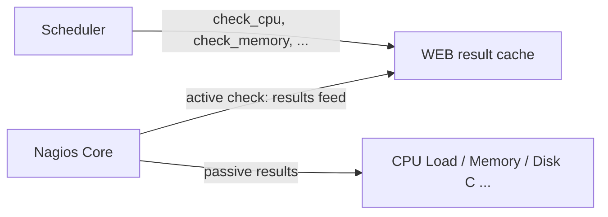

# Feeding NSClient++ results into Nagios Core

`check_nsclient nsclient results feed` turns one active Nagios check into many
passive ones. It polls the passive result cache of an NSClient++ agent
(`GET /api/v2/results`, WEBServer module) and hands every cached result to
Nagios as a `PROCESS_SERVICE_CHECK_RESULT`, so Nagios runs one check per host
instead of ten or twenty.

This is the pattern `check_multi` used to provide, on top of the REST API:



The end-to-end scenario, including the NSClient++ side, is documented in the
NSClient++ manual under *Monitoring Scenarios → Polled Passive Checks (Nagios
Core)*. This page covers the `check_nsclient` side.

## Requirements

* NSClient++ with the WEBServer result cache enabled
  (`[/settings/WEB/server/results] enabled = true`) and something submitting
  to its channel, typically the Scheduler.
* A REST user whose role grants `results.list`, `results.get` and `login.get`.
* `check_nsclient` installed on the Nagios server and logged in **as the user
  Nagios runs its checks as** (usually `nagios`), because that is the user that
  runs the active check:

```
sudo -u nagios check_nsclient nsclient auth login winsrv01 \
    --url https://winsrv01.example.com:8443 \
    --username nagios \
    --ca /etc/nagios/nsclient-ca.pem
```

The password is prompted for (or read from `CHECK_NSCLIENT_PASSWORD`). One
profile per agent, named after the host, keeps the Nagios command definition
simple.

> **Credential store.** `check_nsclient` keeps the password and API token in
> the operating system credential store. On a Linux Nagios server that is a
> Secret Service (for example `gnome-keyring`) that must be reachable from the
> `nagios` user's session when Nagios runs the check. Verify with
> `sudo -u nagios check_nsclient nsclient --profile winsrv01 ping` from the
> same environment Nagios uses before wiring the check up.

## The `results` commands

| Command                    | What it does                                                                 |
|----------------------------|------------------------------------------------------------------------------|
| `results list [filters]`   | List the cached results. **Drains** them unless the agent has `clear on poll = false`. |
| `results show <key>`       | Show one result by key (a lookup: never drains).                             |
| `results delete <key>`     | Drop one result from the cache.                                              |
| `results clear`            | Empty the cache.                                                             |
| `results feed ...`         | Poll the cache and submit every result to Nagios (see below).                |

Filters, accepted by `list` and `feed`, are applied on the agent and combined
with AND:

| Option        | Meaning                                                              |
|---------------|----------------------------------------------------------------------|
| `--channel`   | Only results that arrived on this channel                            |
| `--host`      | Only results the agent recorded under this host name                 |
| `--command`   | Only results for this command                                        |
| `--alias`     | Only results submitted under this alias                              |
| `--status`    | Comma separated list of `ok`, `warning`, `critical`, `unknown` (or `0`-`3`) |

```
$ check_nsclient nsclient --profile winsrv01 results list
╭──────────────────┬─────────┬─────┬────────────────────────────────╮
│ key              │ result  │ age │ message                        │
├──────────────────┼─────────┼─────┼────────────────────────────────┤
│ winsrv01/CPU Load│ OK      │ 12  │ OK: CPU load is ok.            │
│ winsrv01/Disk C  │ WARNING │ 12  │ WARNING: C: 85% used           │
│ winsrv01/Memory  │ OK      │ 12  │ OK: memory within bounds       │
╰──────────────────┴─────────┴─────┴────────────────────────────────╯
```

`--long` (or the global `--output-long`) adds the perf data, host, command,
alias, channel, report count and timestamps; `--output json` returns the
server's documents unchanged.

## `results feed`

```
check_nsclient nsclient --profile <agent> results feed
    (--command-file <FILE> | --spool-dir <DIR> | --dry-run)
    [--nagios-host <HOST>] [--service <TEMPLATE>] [--max-age <SECONDS>] [--worst]
    [filters]
```

Exactly one delivery target is required:

| Target                  | How the results reach Nagios                                                                                   |
|-------------------------|----------------------------------------------------------------------------------------------------------------|
| `--spool-dir <DIR>`     | Writes one check result file holding every result into `check_result_path` (default `/usr/local/nagios/var/spool/checkresults`) plus the `.ok` marker the reaper waits for. Preferred: many results cost one file and nothing blocks. |
| `--command-file <FILE>` | Appends one `PROCESS_SERVICE_CHECK_RESULT` line per result to the external command file (default `/usr/local/nagios/var/rw/nagios.cmd`). Needs `check_external_commands=1`. Opening the pipe blocks while Nagios is not reading it, which the check timeout bounds. |
| `--dry-run`             | Prints the `PROCESS_SERVICE_CHECK_RESULT` lines instead of delivering them. Note that the poll still drains the cache unless the agent has `clear on poll = false`. |

Every result becomes a passive check for:

* **host** `--nagios-host` when given, otherwise the host name the agent
  recorded. Pass `$HOSTNAME$` from the Nagios command so the results land on
  the Nagios host object whatever the agent calls itself.
* **service** the `--service` template, default `${alias-or-command}`, which
  is the schedule name for scheduled checks (`CPU Load`, `Disk C`, ...) and
  the command name otherwise. Variables: `${alias-or-command}`, `${alias}`,
  `${command}`, `${host}`, `${source}`, `${channel}`, `${key}`. A template
  naming an unknown variable is refused before anything is polled.
* **status and output** the cached status, `message|perf`. Multi-line
  messages are escaped the way Nagios expects.
* **check time** when the result was produced (`result_seen`), so Nagios's
  freshness checking sees a stale result as stale even if it is re-fed.

With `--max-age <SECONDS>` a result whose `age` exceeds the limit is submitted
as UNKNOWN with a `stale result, last reported ...` prefix instead. This is for
agents configured with `clear on poll = false`, where a check that stopped
reporting would otherwise be re-fed as its last good state forever; with the
default draining poll, Nagios's own `check_freshness` is enough.

The plugin output of the active check summarises the feed:

```
OK: Fed 3 result(s) to Nagios: 2 ok, 1 warning, 0 critical, 0 unknown|fed=3 ok=2 warning=1 critical=0 unknown=0 stale=0
```

The exit code is **OK when the feed worked**, whatever the fed results said,
because the passive services carry their own states and alerting twice is
rarely wanted. `--worst` returns the worst fed state instead. Anything that
stops the feed (agent unreachable, cache disabled, missing privilege, bad
template, unwritable target) is reported as `UNKNOWN: ...` with exit code 3.

Local preconditions (the template, the command file, the spool directory) are
checked **before** the cache is polled, so a misconfiguration fails without
consuming results.

## Nagios object configuration

`nagios.cfg` needs passive results and, for the command file path, external
commands enabled. Freshness checking is what turns a silent agent into an
alert:

```
accept_passive_service_checks=1
check_service_freshness=1
check_external_commands=1
```

One command, one active "feeder" service per agent, and one passive service
per scheduled check:

```
define command {
    command_name    check_nsclient_results
    command_line    /usr/local/bin/check_nsclient nsclient --profile $ARG1$ results feed --nagios-host $HOSTNAME$ --spool-dir /usr/local/nagios/var/spool/checkresults
}

define service {
    use                     generic-service
    host_name               winsrv01
    service_description     NSClient++ results
    check_command           check_nsclient_results!winsrv01
    check_interval          1
    retry_interval          1
}

define service {
    use                     generic-service
    host_name               winsrv01
    service_description     CPU Load
    check_command           check_dummy!3!"No result received from NSClient++"
    active_checks_enabled   0
    passive_checks_enabled  1
    check_freshness         1
    freshness_threshold     300
}
```

The `service_description` must match what the template produces (here the
schedule name `CPU Load`). Set `freshness_threshold` to the scheduler interval
plus the feeder interval plus some headroom; when it expires Nagios runs
`check_command` once, and `check_dummy` (from the standard plugins) reports the
UNKNOWN.

Try it before Nagios does, as the `nagios` user:

```
sudo -u nagios check_nsclient nsclient --profile winsrv01 results feed --nagios-host winsrv01 --dry-run
[1757232000] PROCESS_SERVICE_CHECK_RESULT;winsrv01;CPU Load;0;OK: CPU load is ok.|'total 5m'=3%;80;90
[1757232000] PROCESS_SERVICE_CHECK_RESULT;winsrv01;Disk C;1;WARNING: C: 85% used|'C: %'=85%;80;90
OK: Fed 2 result(s) to Nagios: 1 ok, 1 warning, 0 critical, 0 unknown [dry run]|fed=2 ok=1 warning=1 critical=0 unknown=0 stale=0
```

## Interplay with the agent's cache settings

| Agent setting                | Effect on `feed`                                                                                     |
|------------------------------|------------------------------------------------------------------------------------------------------|
| `clear on poll = true` (default) | Each feed reports what happened since the previous one; between feeds the cache is empty and a feed of zero results is normal. Only one consumer may poll. |
| `clear on poll = false`      | Every feed re-submits every cached result. Use `--max-age` so a check that stopped reporting shows up. Several consumers can poll. |
| `mode = worst`               | A problem that recovered between two feeds is still fed once (as the problem) and the recovery follows with the next poll. Recommended together with a draining poll. |
| `mode = last`                | The newest result wins; a short problem between two feeds is never seen by Nagios.                 |
